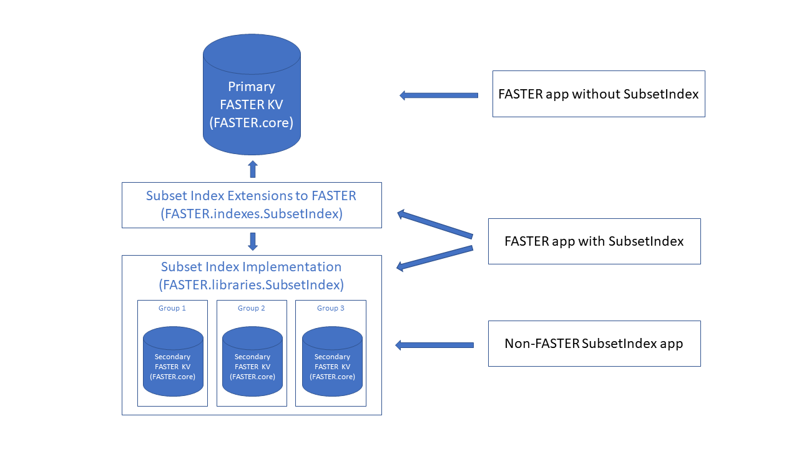
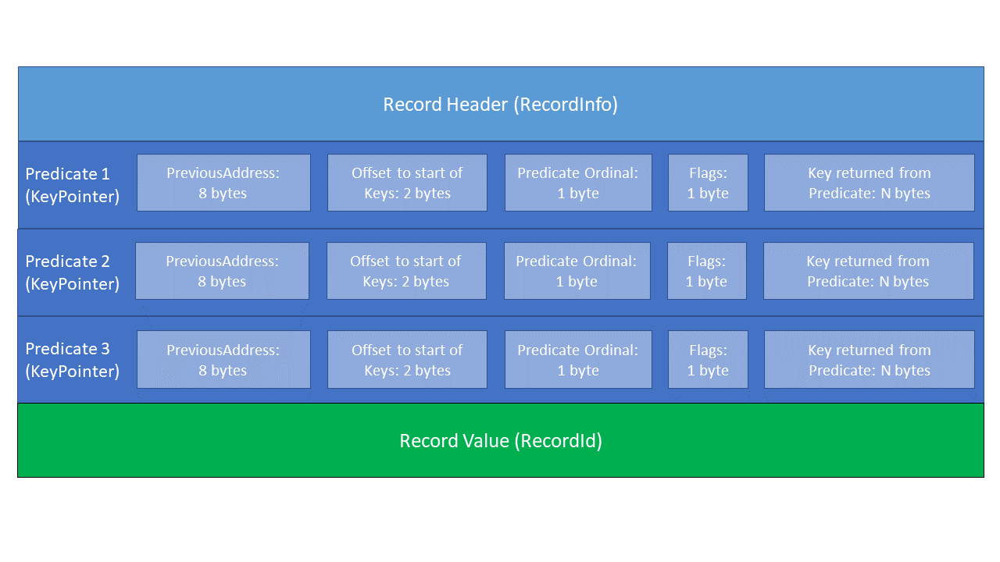
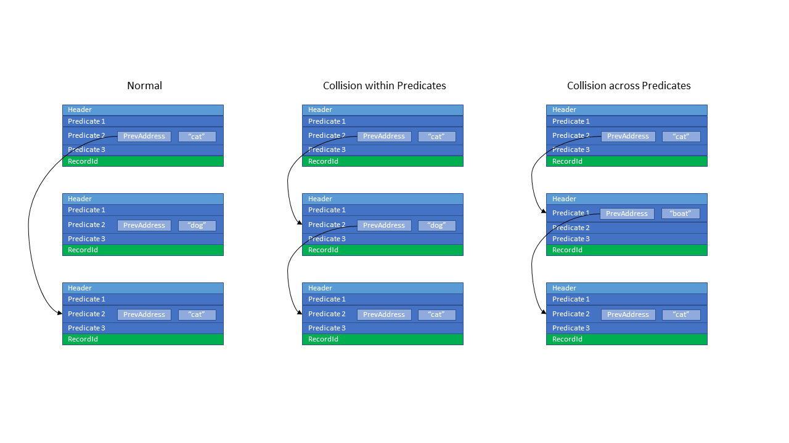

Faster Subset Index
----------------------------------------

FASTER's SubsetIndex is based upon the [FishStore](https://github.com/microsoft/FishStore) prototype. These function as secondary indexes, allowing an application to query on keys other than the single key used by the FasterKV ("Faster Key/Value store").

<!-- Use [markdown-toc by Jon Schlinkert](https://github.com/jonschlinkert) to insert the Table of Contents between the toc/tocstop comments; commandline is: markdown-toc -i <this file> -->

<!-- toc -->

- [Overview](#overview)
  * [FasterKV: Primary Index With Unique Keys](#fasterkv-primary-index-with-unique-keys)
  * [PSFs: Secondary Indexes With Nonunique Keys](#psfs-secondary-indexes-with-nonunique-keys)
    + [Defining Secondary Indexes](#defining-secondary-indexes)
    + [Updating Secondary Indexes](#updating-secondary-indexes)
    + [Querying Secondary Indexes](#querying-secondary-indexes)
    + [Limitations](#limitations)
      - [No Range Indexes](#no-range-indexes)
      - [Fixed-Length `TPKey`](#fixed-length-TPKey)
- [Public API](#public-api)
  * [The Core PSF API](#the-core-psf-api)
    + [`PSFManager`](#psfmanager)
    + [`IPSF`](#ipsf)
  * [The FasterKV PSF API](#the-fasterkv-psf-api)
    + [Registering PSFs](#registering-psfs)
    + [Querying PSFs](#querying-psfs)
    + [The FasterPSFSample playground app](#the-fasterpsfsample-playground-app)
    + [Registering PSFs on FasterKV](#registering-psfs-on-fasterkv)
      - [Registering PSFs on `Restore`](#registering-psfs-on-restore)
  * [Querying PSFs on Session](#querying-psfs-on-session)
- [Code internals](#code-internals)
  * [KeyPointer](#keypointer)

<!-- tocstop -->

# Overview
The FASTER SubsetIndex is based upon the PSFs (Predicate Subset Functions) defined in the [FishStore](https://github.com/microsoft/FishStore) prototype; they allow defining predicates that records will match, possibly non-uniquely, for secondary indexing. The SubsetIndex is designed to be used by any data provider. Currently there is only an implementation using FasterKV as the provider, so this document will mostly reference the implementation of them as a secondary index (implemented using "secondary FasterKVs") for a primary FasterKV store, with occasional commentary on other possible stores.

## FasterKV: Primary Index With Unique Keys
FasterKV is essentially a hash table; as such, it has a single primary key for a given record, and there are zero or one records available for a given key.

- An Upsert (insert or blind update) will replace an identical key, or insert a new record if an exact key match is not found
- An RMW (Read-Modify-Write) will find an exact key match and update the record, or insert a new record if an identical key match is not found
- A Read will find either a single record matching the key, or no records

The FasterKV Key and Value may be [blittable](https://docs.microsoft.com/en-us/dotnet/framework/interop/blittable-and-non-blittable-types) fixed-length, blittable variable length, or .NET objects.

## SubsetIndex Overview: A Secondary Indexes With Nonunique Keys
The FASTER SubsetIndex implements a secondary index by allowing the user to register one or more Predicates that return an alternate key for the record. For example, a record might be { Id: 42, Species: "cat" }. The "primary index" is the key inserted into the primary FasterKV; in this example it is Id, and there will be only one record with an Id of 42. A SubsetIndex might be created for such records by defining a Predicate that returns the Species property.

### Predicates
A Predicate is a function (in C# terms, a delegate, or a lambda such as "v => v.Species;") that operates on the Value of a record and returns a Key that is distinct from the Key in the primary FasterKV instance.

The return from a Predicate is nullable, reflecting the "predicate" and "subset" terminology, which means that the record may or may not "match" the Predicate. For example, a record with no pets would return null, and the record would not be stored for that Predicate. On the other hand, dogs and cats are quite common. This design allows zero, one, or more records to be stored for a single Predicate key, entirely depending on the Predicate definition.

### Predicate Groups
Predicates are registered with the SubsetIndex in Groups. For space efficiency, Predicates should be organized into groups such that it is expected that a record will match all or none of the Predicates in that Group. That is, if a record results in a non-null key for one Predicate in the Group, it results in a non-null key for all Predicates in the Group; and if a record results in a null key for one Predicate in the Group, it results in a null key for all Predicates in the Group).

### Assemblies

As shown in this diagram, there are 3 assemblies involved when defining a SubsetIndex in a FasterKV app:

- **`FASTER.core`**: This is the core FASTER assembly, and has no code that is specific to the SubsetIndex (some enhancements, such as `ReadAtAddress` and `IAdvancedFunctions`, were motivated initially by the SubsetIndex, but are core FASTER features usable by any FASTER app). An app that uses a SubsetIndex will mostly still make the same FASTER calls, except when defining or querying the SubsetIndex.
- **`FASTER.indexes.SubsetIndex`**: This can be thought of as an extension to core FASTER; it uses extension functions to provide the SubsetIndex functionality (this is described further below). It has no storage itself; rather, it is a redirection and coordination layer between `FASTER.core` and `FASTER.libraries.SubsetIndex`. It provides extension wrappers for:
  - Registering Predicate groups
  - Obtaining SubsetIndex-enabled new sessions (other sessions are not allowed)
  - Providing wrappers for some FasterKV operations such as `Flush`, `Checkpoint`, `Recover` to coordinate with the SubsetIndex
  - Providing a session wrapper that:
    - Exposes all the usual `ClientSession` operations such as `Read`, `Upsert`, `RMW`, and `Delete`, wrapping them to keep the SubsetIndex updated.
    - Adds methods for querying Predicates singly or in groups
- **`FASTER.libraries.SubsetIndex`**: This is the actual implementation of the SubsetIndex. Each Group has its own FasterKV instance (Using different Keys and Values than 'FASTER.core`), but these are an implementation detail and are not seen by the client of this assembly other than the Predicate registration options that are passed through to the FasterKV constructor. For an app that uses the SubsetIndex over a different store than FasterKV, this is the only FASTER assembly that app will use.

Note the direction of arrows in the diagram. For a FasterKV app that uses a SubsetIndex, the app talks to the `FASTER.indexes.SubsetIndex` assembly, and indirectly to the `FASTER.libraries.SubsetIndex` assembly because it holds data members of its types. `FASTER.indexes.SubsetIndex` then talks to `FASTER.core` and `FASTER.libraries.SubsetIndex`. However, `FASTER.core` is completely unaware of the SubsetIndex.

Similarly, a non-FasterKV app will use `FASTER.libraries.SubsetIndex` directly, and no other `FASTER` assemblies (except indirectly, because FasterKV instances are used to implement the SubsetIndex).

### Limitations
The current implementation of PSFs has some limitations.

#### No Range Indexes
Because PSFs use hash indexes (and conceptually store multiple records for a given key as that key's collision chain), we have only equality comparisons, not ranges. This can be worked around in some cases by specifying "binned" keys; for example, a date range can be represented as bins of one minute each. In this case, the query will pass an enumeration of keys and all records for all keys will be queried; the caller must post-process each record to ensure it is within the desired range. The caller must decide the bin size, trading off the inefficiency of multiple key enumerations with the inefficiency of returning unwanted values (including the lookuup of the logical address in the primary FasterKV).

#### Fixed-Length `TPKey`
PSFs currently use fixed-length keys; the `TPKey` type returned by a PSF execution has a type constraint of being `struct`. It must be a blittable type; the PSF API does not provide for `IVariableLengthStruct` or `SerializerSettings`, nor does it accept strings as keys. Rather than passing a string, the caller must pass some sort of string identifier, such as a hash (but do not use string.GetHashCode() for this, because it is AppDomain-specific (and also dependent on .NET version)). In this case, the hashcode becomes a "bin" of all strings (or string prefixes) corresponding to that hash code.

# Public API
This section discusses the SubsetIndex public API. As mentioned above, there are two levels: The interface for FASTER clients to add SubsetIndexing to their apps, and the interface for non-FASTER clients.

## FasterKV Client Changes to Use the SubsetIndex
There are very few changes required to enable the SubsetIndex in a FasterKV app:
- Obtain a `FasterKVForSI<K, V>` instance instead of `FasterKV<K, V>`. This is a subclass of `FasterKV<K, V>` so it is identical for non-SubsetIndex operations.
- Obtain a `ClientSessionForSI<Input, Output, Context, Functions>` instance instead of a `ClientSession<Input, Output, Context, Functions>`. This does not inherit from `ClientSession<I, O, C, F>`, but it presents the same interface for non-SubsetIndex operations (including Read, Upsert, RMW, and Delete).
- And of course call the new SubsetIndex functions, as described in the following sessions.

### Samples
An easy way to see the differences is to compare the sample apps in the `cs/samples/SubsetIndex` with other samples. The samples are:
- **BasicPredicate**: This illustrates the simplest form of defining and querying a predicate, with the Predicate using a lambda that simply returns a property of the object rather than defining a key struct.
- **SingleGroup**: This illustrates defining two Predicates in a single group, using a key struct that knows which property of the value it should use as the secondary key. It uses the synchronous `Query` method to illustrate simple boolean AND/OR operations.
- **MultiGroup**: This illustrates defining two Predicates each in their own group, using two separate key structs, each dedicated to a single property of the value to be used as the secondary key. It uses the asynchronous `Query` method to illustrate simple boolean AND/OR operations.

#### The SubsetIndex playground app
The [SubsetIndex playground app](../../cs/playground/SubsetIndex/SubsetIndexApp.cs) app demonstrates much more complex registeration and querying of PSFs, using all overloads of the `Query` API.

### Defining the SubsetIndex 
A FASTER app that uses a SubsetIndex must not instantiate a `FasterKV<K, V>` directly; instead must obtain a SubsetIndex-enabled subclass using `SubsetIndexExtensions.NewFasterKV<K, V>(...)`. This returns an instance of `FasterKVForSI<K, V>`, which is an internal subclass of `FasterKV<K, V>`. 

This subclassed `FasterKV<K, V>`enables `SubsetIndexExtensions.Register(...)` for registering the Predicate groups. Each `Register` call is forwarded to the [`SubsetIndex` implementation](../../cs/src/libraries/SubsetIndex/SubsetIndex.cs), which creates a [`Group`](../../cs/src/libraries/SubsetIndex/Group.cs) internally; this `Group` contains its own `FasterKV` instance, using the Predicate Key type and a RecordId that is the logical address of the record in the Primary `FasterKV` for its Value. All non-null keys returned from the Predicate are linked in chains within that FasterKV instance. Details of this registration are presented in [Registering Predicate Groups](#registering-psfs-on-fasterkv) below.

Creating Predicates in groups has the following advantages:
- A single hashtable can be used for all Predicates in the group, using the ordinal of the Predicate as part of the hashing logic. This can save space.
- Predicates should be registered in groups where it is expected that a record will match all or none of the Predicates (that is, if a record results in a non-null key for one Predicate in the group, it results in a non-null key for all Predicates in the group, and if a record results in a null key for one Predicate in the group, it results in a null key for all Predicates in the group). This saves some overhead in processing variable-length composite keys in the secondary FasterKV; this [KeyPointer](#keypointer) structure is described more fully below.
- All Predicates in a group have the same `TPKey` type, but different groups can have different `TPKey` types.

### Updating the SubsetIndex
A FASTER app that uses a SubsetIndex must not use the `FasterKV<K, V>` methods for obtaining a session; instead it must call the `SubsetIndexExtensions` method `.ForSI` on the `FasterKVForSI<K, V>` to obtain a `ClientSessionForSI<I, O, C, F>` object. This presents an identical interface to the `(Advanced)ClientSession` for Upsert, RMW, or Delete operations, but internally it passes these calls through to the same methods on its contained `(Advanced)ClientSession` instance, then calls the Upsert, Update, or Delete methods on the [`SubsetIndex`](../../cs/src/libraries/SubsetIndex/SubsetIndex.cs) to update the index.

When a record is inserted into the primary FasterKV (via Upsert or RMW), it is inserted at a unique "logical address" (essentially a page/offset combination). Predicates are used to implement secondary indexes in Faster by allowing the user to register a delegate that returns an alternate key for the record; then the logical address of the record in the primary FasterKV is the value that is inserted into the secondary FasterKV instance using the alternate key. This value is referred to as a RecordId; note that this is *not* the actual record value in the primary FasterKV, only its address. The type is termed `TRecordId` and for the primary FasterKV it is a long integer; other data providers may use a different type, as long as it is blittable.

The distinction between the Key and Value defined for the primary FasterKV and the Key and RecordId (Value) in the secondary FasterKV is critical; the secondary FasterKV has no idea of the primary datastore's Value type, nor does it know if the primary datastore even has a Key.

Unlike the primary FasterKV's keys, the Predicate keys may chain multiple records. (The primary FasterKV can support this by returning false from `InPlaceUpdater` and `ConcurrentWriter` methods on the `I(Advanced)Functions` implementations, then using the session's `ReadAtAddress` variants, but the SubsetIndex suports this automatically). To query a Predicate, the user passes a value for the alternate key; all RecordIds that were inserted with that key are returned, and then `ReadAtAddress` is called on the primary FasterKV instance to retrieve the actual records for those RecordIds. Whereas the primary FasterKV returns only a single record (if found) via the `I(Advanced)Functions` implementation on `Read` operations, queries on the SubsetIndex return an `IEnumerable<TRecordId>` or `IAsyncEnumerable<TRecordId>`.

### Querying the SubsetIndex
The `ClientSessionForSI<I, O, C, F>` instance contains several overloads of `Query` and corresponding `QueryAsync` methods, taking various combinations of [`IPredicate`](../../cs/src/libraries/SubsetIndex/IPredicate.cs), `TPKey` types and individual keys, and, for queries across multiple `IPredicates`, `matchPredicate`s (lambdas that are called for each RecordId returned from the Predicates' chains, take boolean parameters that indicate which Predicate(s) the RecordId is present in, and return a boolean indicating whether that RecordId is to be included in the query result).

The simplest query takes only a single [`IPredicate`](../../cs/src/libraries/SubsetIndex/IPredicate.cs) and `TPKey` instance and returns all records that match that key for that Predicate. More complicated forms of `Query` allow specifying multiple Predicates, multiple keys per Predicate, and multiple `TPKey` types (each possibly with multiple Predicates, each possibly with multiple keys).

Because the SubsetIndex stores `TRecordId`s, the SubsetIndex client (that is, the data provider, such as a primary FasterKV) must wrap the `Query` call with its own translation layer to map the `TRecordId` to the actual data record; see `CreateProviderData` in [`ClientSessionForSI`](../../cs/src/indexes/SubsetIndex/ClientSessionForSI.cs).

## Non-FasterKV Client API
As discussed above, the `FASTER.libraries.SubsetIndex` API is intended to be used by any data provider needing a hash-based index that is capable of storing a `TRecordId` from which the provider can extract its full record. However, SubsetIndex update operations must be able to execute the Predicate, which requires knowledge of the provider's Key and Value types. Therefore, [`SubsetIndex`](../../cs/src/libraries/SubsetIndex/SubsetIndex.cs) has two generic types, both of which are opaque to the SubsetIndex:
- `TProviderData`, which is the data passed to PSF execution (the PSF must, of course, know how to operate on the provider data and form a `TPKey` key from it)
- `TRecordId`, which is the record identifier stored as the Value in the secondary FasterKV.

The `TRecordId` has a type constraint of being `struct`; it must be blittable.

### Registering PSFs on FasterKV
[Defining Secondary Indexes](#defining-secondary-indexes) provides an overview of registering PSFs. For the FasterKV provider, this is done on the [IFasterKV](../Interfaces/IFasterKV.cs) interface, because it does not do any session operations itself. TODO revisit for indexing of existing records.

[FPSF.cs](../../../../playground/FasterPSFSample/FPSF.cs) illustrates registering the PSFs. There are several overloads, depending on the number of PSFs per group and whether the PSF can be defined by a simple lambda vs. a more complex definition (which requires an implementation of [`IPSFDefinition`](./IPSFDefinition.cs)).

[`PSFGroup`](./PSFGroup.cs)s are not visible to the client; they are entirely internal. The return from a `RegisterPSF` call is a vector of [`IPSF`](./IPSF.cs), and various combinations of [`IPSF`](./IPSF.cs) and `TPKey` values are passed the the [`QueryPSF` API](#querying-secondary-indexes).

Each [`PSFGroup`](./PSFGroup.cs)s contains its own internal "secondary" FasterKV instance, including a hash table (shared by all PSFs, including the PSF ordinal in the hash operation) and log. Because this contains hashed records for all PSFs in the group, PSFs cannot be modified once created, nor can they be added to or removed from the group individually.

#### Registering PSFs on `Restore`
TODO: This is not current
[IFasterKV](../Interfaces/IFasterKV.cs) provides a `GetRegisteredPSFNames` method that returns the names of all PSFs that were registered. Another provider would have to expose similar functionality. At `Restore` time, before any operations are done on the Primary FasterKV, the aplication must call `RegisterPSF` on those names for those groups; it *must not* change a group definition by adding, removing, or supplying a different name or functionality (lambda or definition) for a PSF in the group; doing so will break access to existing records in the group.

If an application creates a new version of a PSF, it should encode the version information into the PSF's name, e.g. "Dog v1.1". The application must keep track internally of all PSF names and functionality (lambda or definition) for any groups it has created.

Dropping a group is done by omitting it from the `RegisterPSF` calls done at `Restore` time. This is the only supported versioning mechanism: "drop" a group (by not registering it) and then create a new group with the updated definitions (and possibly changed PSF membership).

# Code internals
This section presents a high-level overview of the PSF internal design and implementation.

## KeyPointer
TODO

Notes:
- generics don't have type constraint for ": nullable" (but they can for notnull)
-